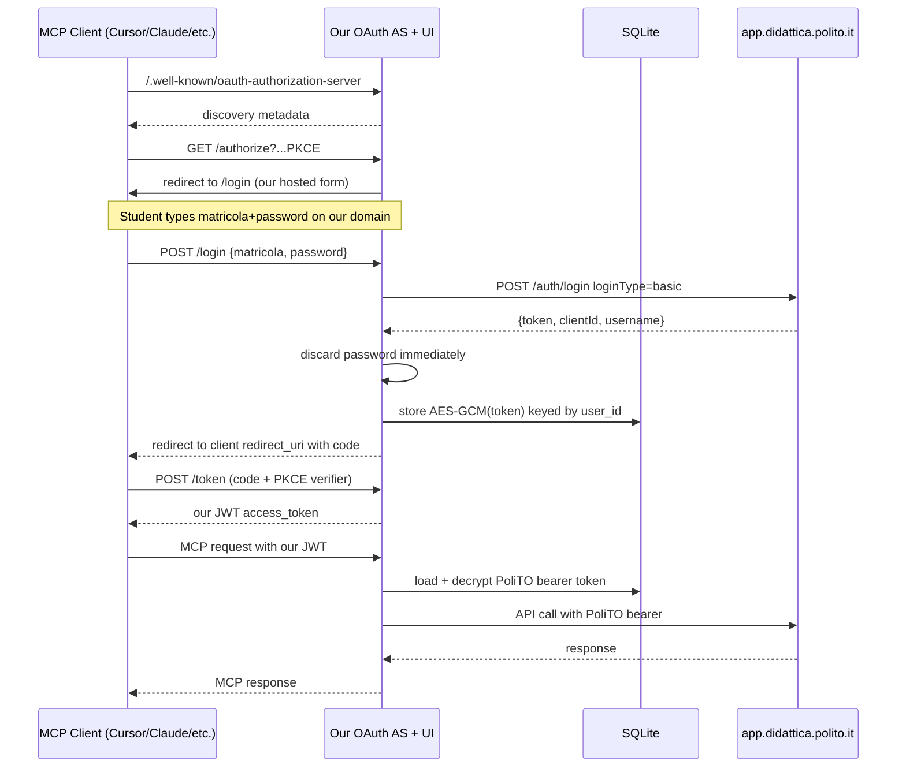

# PoliTO MCP Server

Unofficial hosted remote MCP server wrapping the [PoliTO student API](https://github.com/polito/api-spec). v1 hosted, password-form auth (Option 3 with hardening), no widgets yet, defer PoliTO outreach until we have a working demo.

## Stack

- **Language**: TypeScript end-to-end (matches polito/students-app, has @polito/student-api-client, Skybridge is TS-first).
- **MCP SDK**: `@modelcontextprotocol/sdk` over Streamable HTTP transport.
- **Web framework**: Hono (small, fast, runs on Node/Bun/Workers — gives us flexibility).
- **DB**: SQLite via better-sqlite3 (one file, trivial backup; migrate to Postgres only if needed).
- **PoliTO API client**: install `@polito/student-api-client` from polito/api-spec (already published) and wrap it.
- **Hosting**: Fly.io, EU region (Frankfurt/Milan), persistent volume for the SQLite file.
- **Crypto**: AES-256-GCM via Node `crypto`, scrypt for any user-derived key material.
- **Observability**: Pino with strict redaction + Sentry (body redaction enforced in CI).

## Architecture



## Phase 1 — Hosted MCP server (ship target: ~1-2 weeks part-time)

### Repo layout

```
polito-mcp/
├── README.md                # Strong "UNOFFICIAL" banner, threat model, link to source
├── SECURITY.md              # Reporting, threat model, what we do/don't store
├── PRIVACY.md               # What touches our servers, retention, deletion
├── apps/server/
│   ├── src/
│   │   ├── index.ts         # Hono app + MCP HTTP transport mount
│   │   ├── auth/            # Our OAuth 2.1 AS (issuer, authorize, token, revoke, discovery)
│   │   │   ├── strategy.ts  # Pluggable interface: PasswordStrategy | SsoStrategy
│   │   │   └── password.ts  # POST /auth/login (basic) → discard password → store token
│   │   ├── mcp/
│   │   │   ├── server.ts    # MCP server bootstrap
│   │   │   └── tools/       # One file per tool group (student, grades, courses, ...)
│   │   ├── polito/          # Thin wrapper around @polito/student-api-client
│   │   ├── db/              # better-sqlite3 + migrations (users, tokens)
│   │   ├── crypto/          # AES-GCM encrypt/decrypt + key derivation
│   │   └── http/login.tsx   # Hardened login page (server-rendered, no JS deps)
│   └── tests/               # Vitest; includes log-redaction tests
└── infra/fly.toml
```

### MCP tools (v1)

Read-only essentials + a few safe writes:

- `get_profile` → `GET /me`
- `get_grades` → `GET /grades`
- `get_provisional_grades` → `GET /provisional-grades`
- `accept_provisional_grade(id)` → `POST /provisional-grades/{id}/accept`
- `reject_provisional_grade(id)` → `POST /provisional-grades/{id}/reject`
- `list_deadlines(fromDate?, toDate?)` → `GET /deadlines`
- `list_today_lectures` → derived from `/me/lectures`
- `list_courses` → `GET /courses`
- `get_course(id)` → `GET /courses/{id}`
- `list_messages` → `GET /messages`
- `mark_message_read(id)` → `PUT /messages/{messageId}/read`
- `list_notifications` → `GET /notifications`
- `list_exams` → `GET /exams`
- `list_bookings` → `GET /bookings`
- `get_unread_emails_count` → `GET /unreadEmails`

Each tool gets a typed Zod input schema, returns plain JSON, and emits structured errors when the upstream PoliTO call fails (so the LLM can recover gracefully).

### OAuth AS endpoints

- `GET /.well-known/oauth-authorization-server` — discovery (issuer, endpoints, supported flows)
- `GET /.well-known/openid-configuration` — minimal OIDC for ChatGPT compat
- `GET /authorize` → renders our hardened login form (`apps/server/src/http/login.tsx`)
- `POST /authorize` → handles login submission, calls PoliTO, mints auth code
- `POST /token` → exchanges code (with PKCE) for our JWT access token
- `POST /revoke` → revokes both our JWT and the upstream PoliTO token (`DELETE /auth/logout`)
- `DELETE /me/data` — full account wipe (admin-only header for now; tool-callable later)

We register as our own OAuth Authorization Server. MCP clients (ChatGPT, Cursor) handle dynamic client registration via RFC 7591 (Hono route).

### Auth strategy interface (futureproofing for PoliTO SSO)

```ts
interface AuthStrategy {
  startAuthorize(req): Promise<{ redirectTo: URL } | { renderLogin: true }>
  completeAuthorize(req): Promise<{ politoToken: string; politoUsername: string; politoClientId: string }>
}
```

Day 1: only `PasswordStrategy` is implemented. Day N (after PoliTO grants redirect_uri): drop in `SsoStrategy` that does the `uid`/`key` exchange. Zero changes elsewhere in the codebase.

### Security mitigations (non-negotiable, all in v1)

- Password is **never** written to disk, never logged, lives in memory only for the duration of one `POST /auth/login` call to PoliTO, then immediately overwritten (`crypto.randomFillSync` on the buffer).
- Bearer tokens stored in DB as AES-256-GCM ciphertext. Encryption key = HKDF(server_master_key, user_id). Compromising the DB alone yields no usable tokens; compromising both DB and the master key still requires our active code path to decrypt per-user.
- TLS only, HSTS preload, strict CSP `default-src 'none'; form-action 'self'; style-src 'self'; img-src 'self'`, no inline JS, no third-party scripts on the login page.
- Rate limits on `/authorize` POST: 5/min/IP + 3/min/matricola. Brute-force attempts emit Sentry alerts but don't propagate PoliTO's lockout (we 429 before forwarding).
- Pino logger configured with allow-list of fields. Vitest test in CI POSTs a synthetic password and asserts it never appears in captured log output.
- `DELETE /me/data` removes the encrypted token row AND calls upstream `DELETE /auth/logout` to revoke it server-side at PoliTO. Visible from a static `/account` page.
- README has a giant "**UNOFFICIAL — not affiliated with Politecnico di Torino. Your password transits this server to be exchanged for an API token. Source: <repo>. Operator: <name>.**" banner. Same disclosure on the login form above the submit button.
- Source code public from day 1 (MIT or AGPL — TBD with you).

### Token refresh policy

- No password storage → no silent refresh.
- On upstream 401, mark token revoked, return MCP error `invalid_grant` with a re-auth URL the client surfaces. User logs back in once and we're good for weeks (PoliTO tokens are long-lived per the official app behavior).

### Tests

- Vitest unit tests for crypto round-trip, log redaction, rate limiter.
- Integration tests against [Prism mock API](https://github.com/polito/api-spec) (per polito/api-spec README) for every MCP tool.
- One end-to-end test against the real PoliTO endpoint using a throwaway test account.

### Deployment

- Fly.io with one machine, `fra` (Frankfurt) region, 256 MB RAM, persistent volume for SQLite.
- Secrets via `fly secrets set` (master encryption key, JWT signing key, Sentry DSN).
- Custom domain (you pick — must not violate trademark; e.g. `polito-helper.app`, `polimcp.app`). `.polito.it` is off-limits.
- GitHub Actions CI: build, test, log-redaction check, then deploy on main.

## Phase 2 — Deferred (post-demo)

Sketched only, do not build in Phase 1:

1. **PoliTO outreach** with the working demo + analytics: open an issue at [polito/students-app](https://github.com/polito/students-app/discussions) requesting either a `platform=web` callback to a registered URL, or a proper OAuth 2.1 client_id with `redirect_uri` whitelisting.
2. **Drop in `SsoStrategy`** once granted. Zero changes to MCP tools.
3. **Skybridge ChatGPT App with widgets**: today's lectures card, grades chart, exam booking card, provisional-grade accept/reject card. Submit to ChatGPT App Directory.
4. **Cover more endpoints**: places (maps), bookings (room booking flow), tickets, surveys, job offers, courses files browsing.

## Open decisions to make before coding

- Domain name (must avoid trademark)
- License: MIT vs AGPL. AGPL forces forks/hosts to stay open, which protects the auditability story.
- Where you'll host the code (your personal GitHub org vs a new org for the project)
- Who operates the demo deployment (just you, or do you want to bring in a fellow PoliTO student as co-maintainer for the trust story)